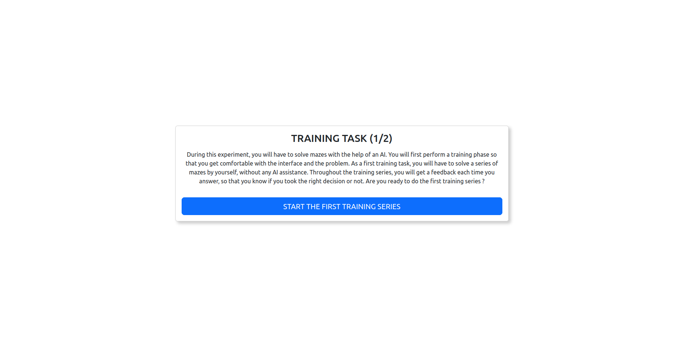
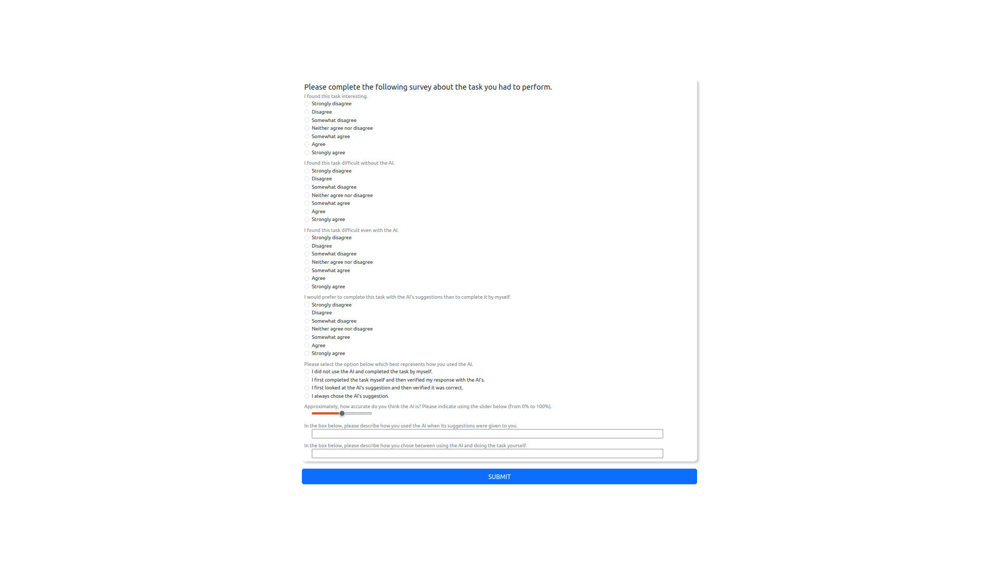
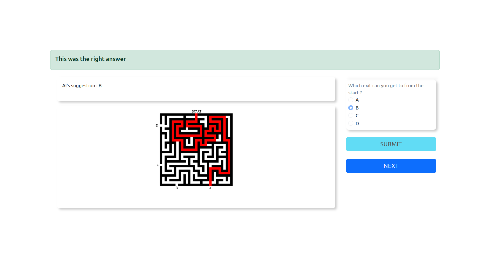

# WebXAll

## 🛠️ Installation & Setup

### Prerequisites

Before getting started, make sure you have the following installed on your machine:

* [Node.js](https://nodejs.org/) (version **18.0.0** or higher recommended)
* [npm](https://www.npmjs.com/) (comes with Node.js)

---

### Clone the Repository

```bash
git clone https://github.com/PAJEAN/WebXAII.git
cd WebXAII
```

### Install Dependencies

Once inside the project folder, run the following command to install all dependencies:

```bash
npm install
```

---

### 📦 Build for Production

To generate the production build of the project, run:

```bash
npm run build
```

This command uses Webpack to bundle and optimize the frontend application. The output will be placed in the [`dist`](./dist) folder.

You can then serve the contents of the `dist` folder.

---

### 🖥️ Start the Backend Server

To run the application, you can start the backend server with:

```bash
npm run dev-back
# Or with nodemon: ./node_modules/nodemon/bin/nodemon.js functions/index.js
```

Make sure the `MAIN_URL` variable in [`src/utils/test_data.js`](src/utils/test_data.js) points to the correct backend address (e.g., `http://localhost:3000`) so that API calls are routed properly.

---

### 🚀 Optional : Start the Development Environment (Frontend Only)

To start the frontend development server with hot-reloading (handled by Webpack), run:

```bash
npm run dev-front
```

During development, the frontend uses mock data provided in [`src/utils/test_data.js`](src/utils/test_data.js).

> **Note:** This file simulates API responses and is useful when the backend is not running.

---


## 🧩 Customizing Server content

To use your own data with the application, you need to modify the content of the `data/` directory located in the backend.

The structure is as follows:

```
functions/
└── data/
    ├── protocols/
    │   └── p1-test.json          # Protocol file
    ├── user-data/                # Directory in which user results will be stored
    └── users.json                # User configuration file (connection module)
```

### 👤 Connection module

All users are defined in the [`users.json`](functions/data/users.json) file.

Example:

```json
{
    "user1": {
        "roles": "user",
        "protocol": "p1-test.json"
    },
    "user2": {
        "roles": "user",
        "protocol": "p2-test.json"
    },
    "user3": {
        "roles": "user",
        "protocol": "p2-test.json"
    }
}
```

* `"user1"`, `"user2"` and `"user3"` are the **user IDs**.
* `"roles"` defines the role (currently unused but reserved for permission levels).
* `"protocol"` refers to a file in the `protocols/` folder, which describes the expected experiment for that user.

> ℹ️ You can assign the same protocol file to multiple users.

> ⚠️ Make sure that each protocol filename in `users.json` matches an actual file in the `protocols/` folder.

---
## 📋 Implementing a protocol

A protocol file (in `protocols/`) is a JSON file which defines all the content for a given protocol. It is defined as
a list of views, and each view is defined as an object (or dictionary).

```json
   [
      {
        "type":  "p-instruction",
        [...]
      },
      {
        "type":  "p-questionnaire",
        [...]
      },
      {
        "type":  "p-task",
        [...]
      }
   ]
```
The views can be configured as follows.

### Instruction view

An instruction view is obtained by using the type ```"type": "p-instruction"```.
It supports the following configuration attributes (besides ```"type"```).
* "title" : Title displayed in bold (text).
* "body_text" : Text content (text).
* "button_text" : Text content of the button (text).
* "with_button" : Whether to display a button allowing to go to the next view or not (boolean).
* "countdown" : If not -1, defines a time after which the application automatically goes to the next view, even if the button was not pressed by the user. The timer is shown in the view (default : **-1**, integer).

Example :

```json
{
  "type": "p-instruction",
  "title": "Training task (1/2)",
  "body_text": "During this experiment, you will have to solve mazes with the help of an AI. You will first perform a training phase so that you get comfortable with the interface and the problem. As a first training task, you will have to solve a series of mazes by yourself, without any AI assistance. Throughout the training series, you will get a feedback each time you answer, so that you know if you took the right decision or not. Are you ready to do the first training series ?",
  "button_text": "Start the first training series",
  "with_button": true
}
```


### Questionnaire view

A questionnaire view is obtained by using the type ```"type": "p-questionnaire"```. It is defined by the following 
structure of attributes (besides ```"type"```).
* ```"questions"``` : list of question objects, which are each defined by a dictionary containing the following attributes:
  * ```"type"``` : defines the type of the question (either ```"radio"``` for exclusive choices, ```"checkbox"``` for non-exclusive
  choices, ```"textfield"``` for an open text answer and ```"slider"``` for a slider input).
  * ```"answers"``` : list of possible answers if applicable (list of text strings).
  * ```"primary_text"``` : Title of the question to be written in bold above the choices (text, optional).
  * ```"secondary_text"``` : Additional text for the question to be written in smaller characters (text, optional).

Example :



```json
{
  "type": "p-questionnaire",
  "questions": [
    {
      "type": "radio",
      "primary_text": "Please complete the following survey about the AI that assisted you.",
      "secondary_text": "I believe the AI is a competent performer.",
      "answers": [
        "Strongly disagree",
        "Disagree",
        "Somewhat disagree",
        "Neither agree nor disagree",
        "Somewhat agree",
        "Agree",
        "Strongly agree"
      ]
    },
    [...]
    {
      "type": "slider",
      "primary_text": "",
      "secondary_text": "Approximately, how accurate do you think the AI is? Please indicate using the slider below (from 0% to 100%).",
      "answers": [
        ""
      ]
    },
    [...]
    {
      "type": "textfield",
      "primary_text": "",
      "secondary_text": "In the box below, please describe how you chose between using the AI and doing the task yourself.",
      "answers": [
        ""
      ]
    }
  ]
}
```
### Task view

A task view is obtained by using the type ```"type": "p-task"```. Each task is defined by an object (or dictionary) 
containing the following attributes (besides ```"type"```).
* ```"title"``` : Title of the task (text, optional).
* ```"desc"``` : Text description of the task to be displayed below the title (text, optional). 
* ```"question"``` : Question and possible answers which are submitted to the user for every instance of the task. It is defined by a dictionary which accepts the same attributes as the question dictionary in the questionnaire view. However, it only supports the types ```"radio"``` and ```"checkbox"``` in this context.
* ```"show_progression_bar"``` : Whether to show the progression bar on the view (default: **false**, optional, boolean).
* ```"randomize"``` : Whether to randomize the order used to display the instances to the user (default: **false**, optional, boolean).
* ```"timer"``` : If not -1, defines a time limit in seconds for the user to give an answer to the instance. If the time is expired, the view goes to the next instance. If defined, the timer is shown on the view (default : **-1**, integer).
* ```"feedback_answer_activated"``` : Whether to show a feedback on the correctness of the answer (default: **false**, optional, boolean).
* ```"feedback_answer_correct"``` : Text to show to the user when they are correct (text, optional).
* ```"feedback_answer_wrong"``` : Text to show to the user when they are wrong (text, optional).
* ```"feedback_answer_show_expected"``` : Whether the expected answer is indicated to the user as part of the feedback (default: **false**, optional, boolean).
* ```"feedback_answer_expected_text"``` : Text to introduce the expected answer to the user (text, optional).
* ```"instances"``` : list of objects which describe all the instances of the task. Each instance is described by a dictionary with the following attributes:
  * ```"input"``` : Dictionary describing the input and containing the following attributes:
    * ```"is_image"``` : Whether the input is an image (boolean)
    * ```"label"``` : Text description of the input, or path to the image (text).
    * ```"title"``` : Title to be displayed below the input (text, optional).
  * ```"model"``` : Dictionary describing the model prediction and containing the same attributes as for ```"input"```.
  * ```"explanations"``` :  List of dictionaries describing each explanation. Each of them is described by a dictionary containing the same attributes as for ```"input"```.
  * ```"expected"``` : Index of the expected answer, if applicable (positive integer, optional).

Example : 



```json
{
  "type": "p-task",
  "title": "",
  "desc": "",
  "show_progression_bar": false,
  "randomize": true,
  "timer": -1,
  "feedback_answer_activated": true,
  "feedback_answer_correct": "This was the right answer",
  "feedback_answer_wrong": "This was not the right answer",
  "instances": [
    {
      "model": {
        "is_image": false,
        "label": "AI's suggestion : B",
        "title": ""
      },
      "explanations": [
        {
          "is_image": true,
          "label": "assets/vasconcelos2023/mediummaze_sol.png",
          "title": ""
        }
      ],
      "expected": 1
    }
  ],
  "question": {
    "type": "radio",
    "primary_text": "",
    "secondary_text": "Which exit can you get to from the start ?",
    "answers": [
      "A",
      "B",
      "C",
      "D"
    ]
  }
}
```
---

## Reproducing the interface of (Vasconcelos et al, 2023)

As a demonstration, we propose to configure a WebXAII instance in order to reproduce the interface of the Study 1 presented in the following article.

> Vasconcelos, Helena, Matthew Jörke, Madeleine Grunde-McLaughlin, Tobias Gerstenberg, Michael S. Bernstein, et Ranjay Krishna. « Explanations Can Reduce Overreliance on AI Systems During Decision-Making ». Proc. ACM Hum.-Comput. Interact. 7, nᵒ CSCW1 (16 avril 2023): 129:1-129:38. https://doi.org/10.1145/3579605.

To set up the WebXAII server, you need to replace the directory `functions/data/` by `reproduction_Vasconcelos2023/data/`.

Then, you can build the instance and start the backend with the following commands.
```bash
npm run build
npm run dev-back
```

The four protocols are made available through the users `A`, `B`, `C` and `D`. They are fully described in [our article](). Out of simplicity, we only created four users in `users.json`. Note that there should be as many users as participants in order to actually conduct the experiment on a production server.

Parfait ! Voici une section claire et complète que tu peux ajouter à ta documentation, expliquant comment un utilisateur peut ajouter un **composant personnalisé d’interface** à son expérience :

---

## 🧱 Adding a Custom UI Page

If you want to add a new custom page (a *customElement*) for a specific experiment or protocol, follow the steps below.

### 📁 1. Create a New Page Component

Navigate to the `js/pages/` folder and create a new JavaScript file for your component.

> You can use the provided boilerplate in this folder as a starting point.

---

### 🧩 2. Register the Component in `index.js`

Open `js/index.js` and import your new component so that it’s included in the application build.

Example:

```javascript
import 'JS/pages/MyCustomPage';
```

---

### 🗂️ 3. Declare the Component in the `js/pages/__namespaces__.js` file

After creating and importing your component, you need to **register** it within the page configuration system.

#### a) Add the Component Name to `PAGE_NAMES`

In `js/pages/__namespaces__.js`, add a new entry to `PAGE_NAMES` object (use a clear and unique name prefixed, ex. `p-`.):

```javascript
export const PAGE_NAMES = {
    AUTHENTICATION: 'p-authentication',
    DESC:           'p-instruction',
    EXPE:           'p-task',
    FORM:           'p-questionnaire',
    CUSTOM:         'p-custompage' // 👈 Your new component name.
};
```

🧠 **Why this matters**: This constant allows you to reference the page name consistently throughout your codebase. It is especially important because the `"type"` fields used in the protocol files must exactly match the names of the custom elements defined in the application.

Then, you can use `PAGE_NAMES.CUSTOM` when defining the name of your customElement in your page file:

```js
// In your custom page.
import { PAGE_NAMES } from 'JS/pages/__namespaces__';
// ...
const PAGE_NAME = PAGE_NAMES.DESC;
```

---

#### b) Define the Page’s Routing in `PAGES_INFO`

Finally, declare your new page in the `PAGES_INFO` constant:

```javascript
export const PAGES_INFO = {
    [PAGE_NAMES.AUTHENTICATION]: {
        route: {
            path: '/',
            title: 'Authentication',
            is_default: true
        },
    },
    [PAGE_NAMES.CUSTOM]: {
        route: {
            path: '/custom',
            title: 'My Custom Page'
        },
    },
    [PAGE_NAMES.DESC]: {
        route: {
            path: '/desc',
            title: 'Instruction'
        },
        class_type: Desc
    },
    // ...
};
```

* `path`: the URL fragment for routing (e.g., `/custom`).
* `title`: displayed title page.
* `is_default`: whether this page loads first when the app starts (only one).
* `roles`: (optional) a string of user roles that are allowed to access this page (ex: *user/manager/administrator*), use "/" as separator. If omitted, the page is accessible to all users, regardless of their role.
* `class_type`: (optional) a JavaScript class that will be instantiated when the page receives its associated data. This enables your page components to work directly with class-based objects instead of relying solely on raw JSON structures or hardcoded keys. Actually, all view-related classes are defined in `js/store/modules/view-classes.js`.

> ✅ Once this step is complete, your new component is fully integrated and can be used in the app’s navigation or as part of a user protocol.

---

## 💾 Data Saving Mechanism

The application automatically **saves data to the server at each view transition** (only on production mode). This mechanism is handled in the `nextView` function located in:

```
js/lib/view-manager.js
```

### 🔄 What Gets Saved?

The data saved during a transition corresponds to the content of the variable:

```
s_save
```

This variable is defined and managed in:

```
js/store/modules/views.js
```

### 📣 How to Update the Saved Data?

To update `s_save` before the transition and trigger a save, simply dispatch the following custom event:

```javascript
store.dispatch(keys.a_update_save, {
  detail: yourData
});
```

Replace `yourData` with the object you want to persist. This data will then be add to `s_save` and sent to the server on the next view change.

> 🔐 This mechanism ensures that data is stored progressively without requiring explicit save buttons in most pages.

## Citing WebXAII

To reference WebXAII, please cite the following article.

> @TODO
